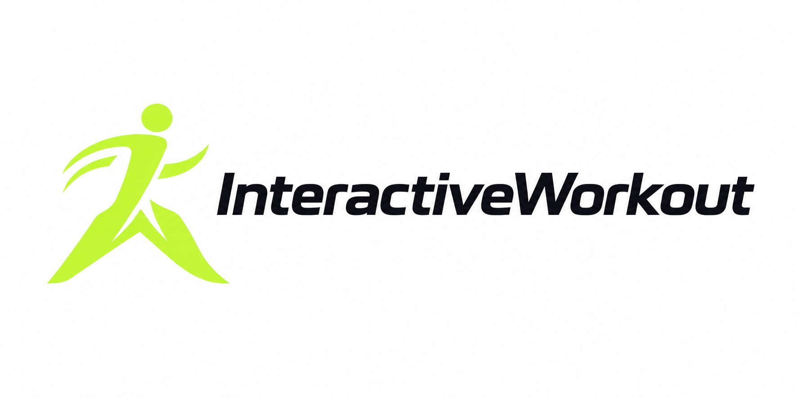

<div align="center">

<picture>
  <source media="(prefers-color-scheme: dark)" srcset="web/public/logo-lockup-dark.png" />
  
</picture>

---

**Waitlist site for the camera-powered workout game — your body is the controller**

[](LICENSE)


*Next.js frontend · Go REST API · PostgreSQL + Prisma · Docker Compose · Self-hosted*

</div>

Pre-launch landing page for InteractiveWorkout, the endless runner you play with real movement. No headset, no wearables: jump, squat, and dodge with your phone or laptop camera.

This repo is the marketing surface only — one page that explains the idea in seconds and collects waitlist signups. No gameplay, no accounts, no payments.

## ✨ Features

**Page**

| Section | Content |
| --- | --- |
| Hero | Value prop, supporting line, primary email capture, live roster counter |
| How it works | 4 steps — Lane Shift, Jump, Squat, Burpee — with custom icons |
| Why it's different | 3 cards — zero hardware, movement becomes input, workout feels like gaming |
| Final CTA | Second signup form for bottom-of-page conversion |
| Footer | Contact email, copyright |

**Waitlist system**

- Email signup with inline validation and clear success state (no dead-end submits)
- Optional one-select signal: "What excites you most?" (general fitness / PT & recovery / just curious)
- Referral codes — each signup gets a `?ref=<code>` link; new signups arriving with `?ref=` are attributed (persisted in localStorage across refreshes)
- Live position: referrals first, then earliest signup — referring bumps you up the list
- Live roster counter (polls the API, pulsing indicator, graceful offline state)
- Share buttons + confetti success card with copyable referral link
- Duplicate emails get a generic 409 (no account-enumeration leak); per-IP rate limiting
- CSV export of the full list (email, interest, referral code, referrer, position, timestamps)
- Responsive mobile → desktop; keyboard accessible with visible focus; `prefers-reduced-motion` disables all animation
- SEO + Open Graph metadata with link-preview image

## 🆚 Scope: what this is (and isn't)

Per the PRD, v1 is a placeholder for interest, not the product:

| In scope | Out of scope |
| --- | --- |
| Single landing page | Multi-page site, blog, FAQ, press |
| Email + one optional interest field | Login, accounts, dashboards |
| Own Postgres table, CSV-exportable | Payments or pricing |
| Basic signup counting | Full analytics stack |
| Responsive layout | Mobile app links, therapist-facing content |

## 📦 Run it

**Prerequisites:** Docker + Docker Compose, Node 22+, Go 1.25+.

```bash
# Everything in one command (builds web + api, runs migration)
docker compose up --build
```

Open http://localhost:3000. API listens on :8080, Postgres on :5432.

**Manual setup** (separate terminals):

```bash
# 1. Postgres
docker compose up db -d

# 2. Apply the migration
cd db && npm install && npx prisma migrate deploy

# 3. API
cd api && go run ./cmd/server

# 4. Frontend
cd web && npm install && npm run dev
```

## ⚙️ Environment

| Variable | Where | Default | Purpose |
| --- | --- | --- | --- |
| `DATABASE_URL` | api, db | — | Postgres connection string (required) |
| `ORIGIN` | api | `http://localhost:3000` | Allowed CORS origin |
| `ADDR` | api | `:8080` | API listen address |
| `NEXT_PUBLIC_API_URL` | web | `http://localhost:8080` | API base URL baked into the client bundle |

## 🔌 API

| Method & path | Body / params | Returns |
| --- | --- | --- |
| `POST /api/waitlist` | `{ email, interest?, referredBy? }` | `{ referralCode, position, referralCount }` |
| `GET /api/waitlist/count` | — | `{ count }` |
| `GET /api/waitlist/:referralCode` | referral code in path | `{ referralCode, position, referralCount }` |

Position = referral count first, then earliest signup.

**Export the list (CSV):**

```bash
cd api && go run ./cmd/export -out waitlist.csv
```

Columns: email, interest, referralCode, referredBy, referralCount, position, createdAt.

## ✅ Tests / checks

```bash
cd api && go test ./... && go vet ./...
cd web && npm run build && npm run lint
cd db && npm run validate
```

## 🏗 Architecture

```
┌────────────────── Browser (thin) ──────────────────┐
│  Next.js App Router · WaitlistForm · LiveCounter    │
│  ?ref= capture → localStorage → POST /api/waitlist  │
└───────────────┬────────────────────────────────────┘
                │ HTTP (CORS: ORIGIN)
┌───────────────▼────────────────────────────────────┐
│  Go API (stdlib net/http, pgx pool)                 │
│  signup · count · referral lookup · rate limiting   │
└───────────────┬────────────────────────────────────┘
                │ SQL
┌───────────────▼────────────────────────────────────┐
│  PostgreSQL (WaitlistSignup, SiteSetting,          │
│  EmailCampaign — Prisma schema + SQL migration)     │
└────────────────────────────────────────────────────┘
```

- `web/` — Next.js 16 + Tailwind 4 frontend (port 3000)
- `api/` — Go REST API, `cmd/server` + `cmd/export` (port 8080)
- `db/` — Prisma schema + SQL migration, `migrate` service in Compose
- Design rules: thin client, all validation and ranking server-side, typed errors end-to-end, no fake scarcity.

See `interactive-workout-waitlist-prd.md` for the full product spec.

## 🗺 Roadmap

- [ ] Live at a public URL (definition of done per PRD)
- [ ] Decide: keep the optional interest field or email-only for max conversion
- [ ] Basic pageview/conversion tracking (no full analytics stack)
- [ ] Follow-up email to ask the interest question later
- [ ] Reuse the signup table for real product auth when the game ships


```bash
cd api && go test ./... && go vet ./...
cd web && npm run build && npm run lint
```

## 🔒 Security

Found a vulnerability? Please do not open a public issue — contact hello@interactiveworkout.game with details instead.

## 📄 License

MIT — see [LICENSE](LICENSE).
